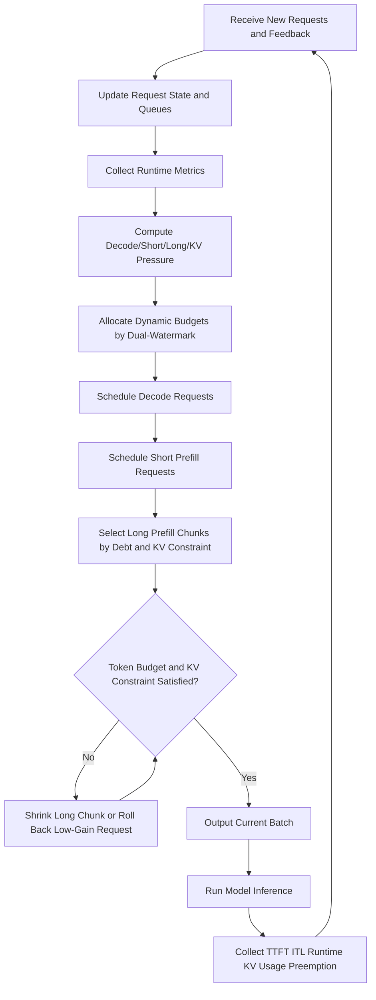
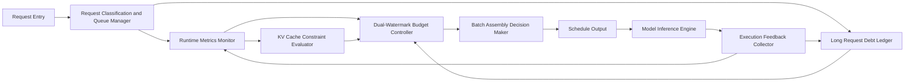
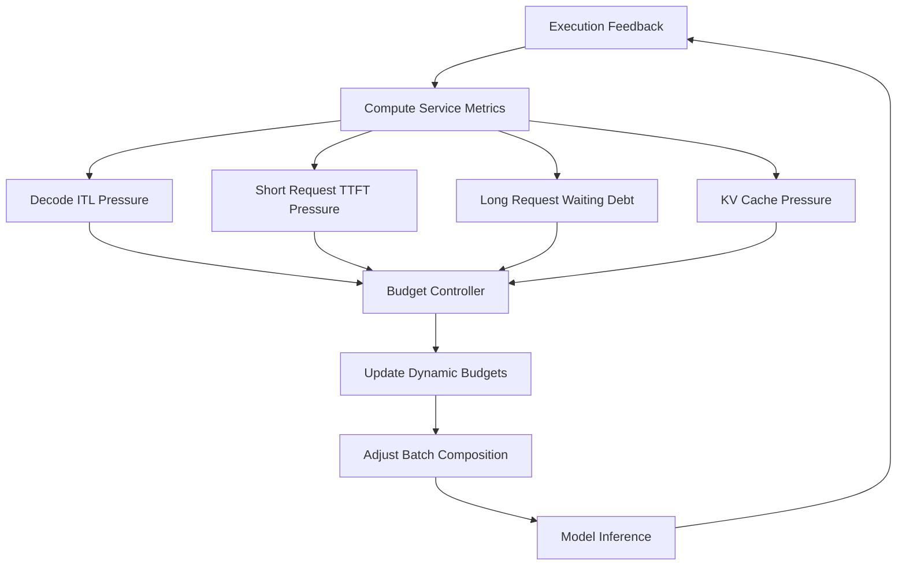

# 面向混合 Long/Short Requests 的 Batch Assembly 优化技术交底书

## 一、技术领域

本发明涉及 LLM Serving 中的 Request Scheduling 与 Batch Assembly 技术，尤其涉及一种面向混合 Long/Short Requests 的 Batch Assembly 优化方法。该方法适用于具有 Continuous Batching、KV Cache Management、Prefill/Decode 混合执行能力的大模型在线推理系统。

## 二、背景技术

大语言模型推理通常包括两个阶段：

1. Prefill 阶段：处理用户输入的上下文 token，生成首个输出 token 所需的中间状态和 KV Cache。该阶段通常计算密集，输入长度越长，单次计算量越大。
2. Decode 阶段：基于已生成 token 和 KV Cache 逐 token 生成后续输出。该阶段通常访存密集，每个请求每轮只推进少量 token，依赖较大的并发 batch 来提升硬件利用率。

在线服务场景中，请求长度差异明显。例如，同一服务实例可能同时接收短请求、中等对话请求和超长文档分析请求。若 Scheduler 直接按照到达顺序组装 batch，Long Request 的 Prefill 可能长时间占用计算资源，导致 Short Request 的 TTFT 升高；若 Scheduler 持续偏向 Short Request 或 Decode Request，Long Request 又可能长期得不到推进，形成 Starvation。

现有系统通常采用 Continuous Batching、Chunked Prefill、固定阈值 Long Request 限制、Decode-first 或 Prefill-first 等策略。这些策略能够缓解部分资源利用问题，但在混合 Long/Short Requests、负载快速变化、KV Cache 空间紧张的场景下，仍难以同时兼顾 TTFT、ITL、Throughput 和 Long Request Fairness。

## 三、现有技术问题

现有技术至少存在以下问题：

1. 固定阈值难以适应负载变化：Long Request 的 chunk 粒度或并发数通常由静态参数决定，不能随 Decode Pressure、Short Request backlog、GPU 利用率和 KV Cache 余量实时调整。
2. Short Request 与 Long Request 之间缺乏 Fairness Control：允许 Short Request 插队可降低 TTFT，但在 Short Request 持续到达时，Long Request 可能长期被推迟。
3. Batch Assembly 只看 token budget 不足：若只依据本轮可调度 token 数组装 batch，可能忽略请求完整生命周期中的 KV Cache 占用，导致过度准入、频繁 Preemption 或 Cache Thrashing。
4. Decode Latency 缺乏保底机制：当 Prefill Request 较多时，Decode Request 可能无法稳定获得足够 batch 位置，造成 ITL 抖动。
5. Feedback Loop 不足：现有组 batch 策略往往缺少基于实际执行耗时、TTFT、ITL、Preemption 次数和 KV Cache 状态的下一轮 budget 修正机制。

## 四、发明目的

本发明旨在提供一种面向混合 Long/Short Requests 的 Batch Assembly 优化方法，通过 Dynamic Budget Control 和 Feedback 调节，在每一轮推理迭代中自适应决定 Decode Request、Short Prefill Request 和 Long Prefill Chunk 的调度比例，从而在保证 Short Request TTFT 和 Decode 平滑输出的同时，持续推进 Long Request，降低 Long Request Starvation 和 KV Cache Thrashing。

## 五、技术方案

本发明的核心思想是：Scheduler 在每轮 Batch Assembly 前，不直接采用固定阈值或单一 Queue 顺序，而是先根据实时负载状态计算多个 Budget Zone，再在 Budget Constraint 和 KV Cache Constraint 下选择请求进入 batch。

### 5.1 Request Classification

Scheduler 将待处理请求按当前状态划分为以下类别：

1. Decode Request：已经完成 Prefill，正在逐 token 生成输出的请求。
2. Short Prefill Request：输入长度低于 Long Request 判定阈值，或预计可在少量轮次内完成 Prefill 的请求。
3. Long Prefill Request：输入长度超过 Long Request 判定阈值，需要被切分为多个 Prefill Chunk 推进的请求。
4. Resumed Request：因资源不足、KV Cache 迁移或 Preemption 而重新进入 Waiting Queue 的请求。

其中，Long/Short Request 判定阈值可以是静态配置值，也可以由历史请求长度分布、SLO 和硬件负载状态动态更新。

### 5.2 三类 Dynamic Budget

每轮 batch 的总 token budget 记为 `B_total`。Scheduler 将其划分为三类 Dynamic Budget：

1. Decode Guarantee Budget `B_decode`：用于保障 Decode Request 每轮稳定推进，降低 ITL 抖动。
2. Short Request TTFT Budget `B_short`：用于优先完成 Short Request Prefill，降低 TTFT。
3. Long Request Progress Budget `B_long`：用于推进 Long Prefill Chunk，防止 Long Request Starvation。

三类 budget 满足：

```text
B_decode + B_short + B_long <= B_total
```

当某类请求不足以消耗其 budget 时，剩余 budget 可按预设顺序或动态收益函数转移给其他类别。

### 5.3 Dual-Watermark Feedback Control

Scheduler 为 Decode Pressure、Short Request Pressure 和 Long Request Debt 分别维护 Low Watermark 与 High Watermark：

1. Decode Pressure 高于 High Watermark 时，提高 `B_decode`，减少 Long Prefill chunk 大小。
2. Short Request waiting pressure 高于 High Watermark 时，提高 `B_short`，允许 Short Request 优先进入 batch。
3. Long Request Debt 高于 High Watermark 时，提高 `B_long`，即使 Short Request 持续到达，也为 Long Request 保留最小 Progress Budget。
4. 某类压力低于 Low Watermark 时，可降低该类 Guarantee Budget，将 budget 释放给其他类别。

### 5.4 Long Request Debt Ledger

Scheduler 为每个 Long Request 维护 Debt Value `D_i`。当 Long Request 因 Short Request 插队、Decode Guarantee 或 KV Cache 不足而未被调度时，增加其 Debt；当 Long Request 被调度并完成若干 token 的 Prefill Chunk 时，减少其 Debt。

示例 Debt 更新方式如下：

```text
若 Long Request i 本轮未被调度：
D_i = D_i + alpha * wait_time_i + beta * remaining_tokens_i

若 Long Request i 本轮被调度 n 个 token：
D_i = max(0, D_i - gamma * n)
```

其中 `alpha`、`beta`、`gamma` 为权重系数。Debt Value 越高，Long Request 在后续轮次中获得 `B_long` 的优先级越高。

### 5.5 KV Cache Joint Constraint

Scheduler 在选择请求进入 batch 时，不仅检查本轮 token budget，还检查以下 KV Cache 条件：

1. 当前分片所需 KV Cache 块是否可分配。
2. 请求完整上下文或保守预留长度是否会导致后续过度 Preemption。
3. Decode Request 继续生成所需 KV Cache 增量是否具有 Guarantee Space。
4. Long Prefill Chunk 推进后是否会使系统进入高风险 Cache Watermark。

当 KV Cache 低于 Safety Watermark 时，Scheduler 减少新 Long Request 准入，优先保障已有 Decode Request 和可快速完成的 Short Prefill Request。

### 5.6 Dynamic Chunk Size 计算

Long Prefill Request 的 chunk size 不采用固定值，而是由以下因素共同决定：

1. 本轮 `B_long` 剩余 budget。
2. Long Request Debt Value。
3. Decode High Watermark 状态。
4. KV Cache Safety Watermark。
5. 硬件执行效率目标，例如避免过小 chunk 导致 Scheduling Overhead 过高。

一种可选计算方式为：

```text
chunk_i = clamp(
    base_chunk + f(D_i) - g(decode_pressure) - h(kv_pressure),
    min_chunk,
    max_chunk
)
```

其中 `f(D_i)` 随 Debt Value 增大而增大，`g(decode_pressure)` 随 Decode Pressure 增大而增大，`h(kv_pressure)` 随 KV Cache Pressure 增大而增大。

## 六、Core Scheduling Flow



## 七、System Modules



各模块功能如下：

1. Request Classification and Queue Manager：维护 Decode Queue、Short Prefill Queue、Long Prefill Queue 和 Resumed Request Queue。
2. Runtime Metrics Monitor：统计当前 running request 数、waiting request 数、各类请求 waiting time、GPU runtime、TTFT、ITL 和 Throughput。
3. Dual-Watermark Budget Controller：根据 pressure metrics 和 watermark 计算 `B_decode`、`B_short`、`B_long`。
4. Long Request Debt Ledger：记录 Long Request 被延迟服务的程度，并影响后续 scheduling priority。
5. KV Cache Constraint Evaluator：评估 Admission Control 和 chunk 推进对 KV Cache 的即时和后续影响。
6. Batch Assembly Decision Maker：在 Budget Constraint 和 KV Cache Constraint 下选择请求并确定每个请求本轮 token 数。
7. Execution Feedback Collector：将执行结果反馈给 Budget Controller 和 Debt Ledger。

## 八、Dynamic Budget Feedback Loop



该 Feedback Loop 使 Scheduler 能够根据上一轮或最近多轮的实际执行情况调整下一轮 Batch Assembly 策略。例如，当 Decode ITL 升高时，下一轮增加 Decode Guarantee Budget；当 Short Request TTFT 升高时，下一轮提高 Short Prefill Budget；当 Long Request Debt 持续累积时，下一轮扩大 Long Request Progress Budget。

## 九、Key Algorithm Description

本节伪代码与前述三幅图对应：核心调度流程图对应“算法 1：单轮 Batch Assembly”，系统模块组成图对应 Decode、Short Prefill、Long Prefill 等子过程，Dynamic Budget Feedback Loop 对应“算法 2：Dynamic Budget Allocation”和“算法 7：Feedback Update”。

### 9.0 结合图示的核心伪代码

以下伪代码采用纯 Markdown fenced code block 形式保存，不包含 LaTeX 伪代码命令，适合在普通 Markdown 阅读器中直接查看。

#### 9.0.1 单轮 Batch 组装主流程

**算法 1：面向混合 Long/Short Requests 的单轮 Batch Assembly**

```text
INPUT:
  new_requests: 新到达 Request 集合
  previous_feedback: 上一轮 Execution Feedback
  scheduler_state: 当前 Scheduler State

OUTPUT:
  batch: 本轮待执行 Batch

1. 将 new_requests 加入 Request Queue，更新 waiting、running、resumed 队列。
2. 根据 previous_feedback 更新 TTFT、ITL、runtime、KV usage 和 Preemption 次数。
3. 统计 Runtime Metrics。
4. 根据 metrics 和 Long Request Debt Ledger 计算 pressure：
     decode_pressure, short_pressure, long_pressure, kv_pressure。
5. 根据 Dual-Watermark 策略计算三类 Dynamic Budget：
     decode_budget, short_prefill_budget, long_prefill_budget。
6. 初始化空 batch，并记录当前 KV Cache 状态快照。
7. 在 decode_budget 内选择 Decode Request 加入 batch。
8. 在 short_prefill_budget 内选择 Short Prefill Request 加入 batch。
9. 在 long_prefill_budget 内按 Debt Value 和 KV Constraint 选择 Long Prefill Chunk 加入 batch。
10. 当 batch 不满足总 token budget 或 KV Cache Constraint 时：
      10.1 若存在可缩小的 Long Prefill Chunk，则缩小收益最低的 Long Prefill Chunk。
      10.2 否则，从 batch 中回退收益最低的新 Admission Request。
11. 提交 batch，并更新本轮被调度请求的 Debt Ledger。
12. 返回 batch。
```

#### 9.0.2 Dynamic Budget Controller

**算法 2：基于 Dual-Watermark Feedback 的 Dynamic Budget Allocation**

```text
INPUT:
  total_token_budget: 本轮总 token budget
  pressures: decode、short、long、kv 四类 pressure
  watermarks: 各类 pressure 的 Low/High Watermark
  debt_table: Long Request Debt Ledger

OUTPUT:
  decode_budget, short_prefill_budget, long_prefill_budget

1. 令 decode_budget = ceil(total_token_budget * base_decode_ratio)。
2. 令 short_prefill_budget = ceil(total_token_budget * base_short_ratio)。
3. 令 long_prefill_budget = total_token_budget - decode_budget - short_prefill_budget。
4. 若 decode_pressure 高于 Decode High Watermark：
     提高 decode_budget。
5. 若 decode_pressure 低于 Decode Low Watermark：
     降低 decode_budget，但不低于 Decode Minimum Guarantee Budget。
6. 若 short_pressure 高于 Short Request High Watermark：
     提高 short_prefill_budget。
7. 若 short_pressure 低于 Short Request Low Watermark：
     降低 short_prefill_budget，但不低于 Short Request Minimum Budget。
8. 计算 Long Request 最大 debt max_debt。
9. 若 long_pressure 高于 Long Request High Watermark，或 max_debt 超过 Debt Trigger：
     设置 long_min_budget = debt_protection_budget。
   否则：
     设置 long_min_budget = base_long_budget。
10. 若 decode_budget + short_prefill_budget + long_min_budget 超过 total_token_budget：
      优先压缩 short_prefill_budget，再压缩 decode_budget。
11. 令 long_prefill_budget = max(long_min_budget,
                                total_token_budget - decode_budget - short_prefill_budget)。
12. 返回 decode_budget, short_prefill_budget, long_prefill_budget。
```

#### 9.0.3 Decode 请求组装

**算法 3：Decode 请求组装**

```text
INPUT:
  decode_queue: Decode Queue
  batch: 当前 Batch
  decode_budget: Decode Guarantee Budget
  kv_cache_state: KV Cache 状态

OUTPUT:
  更新后的 batch 和剩余 decode_budget

1. 按 Priority 和 Arrival Time 遍历 decode_queue。
2. 对每个 Request：
     2.1 若 decode_budget 已耗尽，则停止遍历。
     2.2 估计该 Request 本轮 Decode 所需 token 数 token_need。
     2.3 若 token_need 不超过 decode_budget，且 KV Cache 可承载：
           将该 Request 以 Decode 类型加入 batch。
           为该 Request 预留 token_need 个 token 的 KV 空间。
           从 decode_budget 中扣除 token_need。
3. 返回 batch 和剩余 decode_budget。
```

#### 9.0.4 短 Prefill 请求组装

**算法 4：Short Prefill Request 组装**

```text
INPUT:
  short_prefill_queue: Short Prefill Queue
  batch: 当前 Batch
  short_prefill_budget: Short Request TTFT Budget
  kv_cache_state: KV Cache 状态
  metrics: 实时负载指标

OUTPUT:
  更新后的 batch 和剩余 short_prefill_budget

1. 根据 TTFT Risk、剩余 Prefill 长度和单位 Budget Gain 对 Short Request 排序。
2. 按排序结果遍历候选 Short Request。
3. 对每个 Request：
     3.1 若 short_prefill_budget 已耗尽，则停止遍历。
     3.2 计算该 Request 剩余 Prefill token 数 remaining_tokens。
     3.3 令 token_to_schedule = min(remaining_tokens, short_prefill_budget)。
     3.4 若本次调度对降低 TTFT 的收益不足，则跳过该请求。
     3.5 若 KV Cache 可承载 token_to_schedule：
           将该 Request 以 ShortPrefill 类型加入 batch。
           为该 Request 预留 token_to_schedule 个 token 的 KV 空间。
           从 short_prefill_budget 中扣除 token_to_schedule。
4. 返回 batch 和剩余 short_prefill_budget。
```

#### 9.0.5 长 Prefill 分片组装

**算法 5：Long Prefill Chunk 组装**

```text
INPUT:
  long_prefill_queue: Long Prefill Queue
  batch: 当前 Batch
  long_prefill_budget: Long Request Progress Budget
  kv_cache_state: KV Cache 状态
  debt_table: Long Request Debt Ledger
  pressures: 当前 pressure 指标

OUTPUT:
  更新后的 batch、剩余 long_prefill_budget 和 debt_table

1. 根据 Debt Value 和 waiting time 对 Long Request 排序。
2. 按排序结果遍历候选 Long Request。
3. 对每个 Long Request：
     3.1 若 long_prefill_budget 已耗尽：
           增加该 Request 的 Debt，原因记为“无 Long Request Budget”。
           跳过该请求。
     3.2 根据剩余 budget、Debt Value、Decode Pressure 和 KV Pressure 计算 dynamic chunk_size。
     3.3 当 chunk_size 大于 0 且 KV Cache 无法承载时：
           缩小 chunk_size。
     3.4 若 chunk_size 小于等于 0：
           增加该 Request 的 Debt，原因记为“KV Pressure”。
           跳过该请求。
     3.5 将该 Request 以 LongPrefill 类型加入 batch。
     3.6 为该 Request 预留 chunk_size 个 token 的 KV 空间。
     3.7 从 long_prefill_budget 中扣除 chunk_size。
     3.8 按已服务 token 数降低该 Request 的 Debt。
4. 返回 batch、剩余 long_prefill_budget 和 debt_table。
```

#### 9.0.6 动态 Chunk 计算

**算法 6：Long Request Dynamic Chunk Size 计算**

```text
INPUT:
  request: 待推进的 Long Request
  remaining_long_budget: 剩余 Long Request Budget
  debt: 该请求当前 Debt Value
  decode_pressure: Decode Pressure
  kv_pressure: KV Cache Pressure

OUTPUT:
  chunk_size: 本轮 Long Prefill Chunk Size

1. 读取 request 的基础 chunk size base_chunk。
2. 根据 debt 计算 debt_gain。
3. 根据 decode_pressure 计算 Decode Pressure Penalty decode_penalty。
4. 根据 kv_pressure 计算 KV Pressure Penalty kv_penalty。
5. 计算 raw_chunk = base_chunk + debt_gain - decode_penalty - kv_penalty。
6. 将 raw_chunk 限制在 request 的 min_chunk 和 max_chunk 之间。
7. chunk_size = min(raw_chunk, remaining_long_budget, request 剩余 Prefill token 数)。
8. 返回 chunk_size。
```

#### 9.0.7 反馈状态更新

**算法 7：Execution Feedback 与 Long Request Debt 更新**

```text
INPUT:
  previous_feedback: 上一轮 Execution Feedback
  scheduler_state: 当前 Scheduler State

OUTPUT:
  更新后的 Metrics Window、KV 状态和 Long Request Debt Ledger

1. 若 previous_feedback 为空，则直接返回。
2. 使用 previous_feedback 中的首 token 延迟更新 TTFT 滑动窗口。
3. 使用 previous_feedback 中的相邻 token 延迟更新 ITL 滑动窗口。
4. 使用 previous_feedback 中的批次耗时更新执行耗时滑动窗口。
5. 更新 KV Cache Usage 和近期 Preemption 次数。
6. 遍历当前 Long Prefill Waiting Queue：
     6.1 若某个 Long Request 未出现在上一轮 scheduled request 集合中：
           按 waiting time 和剩余 Prefill token 数增加该请求 Debt。
7. 返回更新后的状态。
```

### 9.1 Pressure Metrics 计算

Decode Pressure 可由以下因素加权得到：

```text
P_decode = w1 * normalized_ITL + w2 * running_decode_count + w3 * decode_wait_jitter
```

Short Request Pressure 可由以下因素加权得到：

```text
P_short = u1 * short_queue_length + u2 * short_wait_time_p95 + u3 * TTFT_risk
```

Long Request Pressure 可由 Debt 总量和最大 Debt 共同表示：

```text
P_long = v1 * sum(D_i) + v2 * max(D_i) + v3 * long_queue_age_p95
```

KV Pressure 可由可用 block 比例、reserved block 比例和 Preemption 次数得到：

```text
P_kv = z1 * used_kv_ratio + z2 * reserved_kv_ratio + z3 * recent_preemptions
```

### 9.2 Budget Allocation

Scheduler 先计算基础 budget：

```text
B_decode_base = ceil(B_total * r_decode)
B_short_base = ceil(B_total * r_short)
B_long_base = B_total - B_decode_base - B_short_base
```

再根据 pressure metrics 修正：

```text
B_decode = adjust(B_decode_base, P_decode, decode_low, decode_high)
B_short = adjust(B_short_base, P_short, short_low, short_high)
B_long = max(B_long_min_if_debt, B_total - B_decode - B_short)
```

其中 `B_long_min_if_debt` 表示当 Long Request Debt 超过阈值时必须保留的最小 Long Request Progress Budget。

### 9.3 Batch Assembly 顺序

一种实施方式中，Batch Assembly 按以下顺序进行：

1. 从 Decode Queue 选择请求，消耗 `B_decode`，保证 streaming output 稳定。
2. 从 Short Prefill Queue 选择可快速完成或高 TTFT Risk 请求，消耗 `B_short`。
3. 从 Long Prefill Queue 选择 Debt 最高且 KV Cache 可承载的请求，计算 dynamic chunk，消耗 `B_long`。
4. 若某类 budget 未用完，将剩余 budget 按收益函数重新分配。
5. 若总 token 或 KV Cache Constraint 被破坏，优先缩小 Long Prefill chunk，再回退低优先级新 Admission Request。

### 9.4 收益函数

为进一步优化 Throughput 和 Latency，Scheduler 可为候选请求计算单位 budget gain：

```text
score_i = a * latency_gain_i + b * throughput_gain_i + c * fairness_gain_i - d * kv_cost_i
```

其中，Short Request 的 `latency_gain_i` 可由预计 TTFT 降幅表示，Long Request 的 `fairness_gain_i` 可由 Debt 减少量表示，`kv_cost_i` 表示该请求或 chunk 对 KV Cache 的占用风险。

## 十、有益效果

与现有固定阈值或单一优先级调度相比，本发明具有以下有益效果：

1. 降低 Short Request TTFT：Short Request TTFT Budget 可在 Short Request backlog 较高时自动提高。
2. 稳定 Decode ITL：Decode Guarantee Budget 可降低 streaming output 抖动，提高用户感知稳定性。
3. 避免 Long Request Starvation：Long Request Debt Ledger 能够在 Short Request 持续到达时为 Long Request 保留推进机会。
4. 降低 KV Cache Thrashing：Batch Assembly 时联合考虑 KV Cache 即时分配和后续预留，减少过度 Admission 和 Preemption。
5. 提升混合负载 Throughput：Long Prefill Chunk Size 随实时 pressure 调整，在保障 Latency 的同时利用剩余算力。
6. 适应负载变化：Dual-Watermark Feedback 机制能够根据实际执行指标持续修正 budget，而非依赖固定参数。

## 十一、可选实施例

### 11.1 面向在线问答服务的实施例

在线问答系统中，Short Request 占比较高，但偶尔存在长文档总结请求。Scheduler 在 Short Request 高峰时提高 `B_short`，保证 Short Request 快速返回 first token；同时为长文档请求累积 Debt。当长文档请求 waiting time 超过阈值后，Scheduler 为其保留 `B_long`，每轮推进一定数量的 Prefill token，避免其长期无法完成。

### 11.2 面向多租户服务的实施例

在 multi-tenant 推理服务中，不同租户可具有不同 SLO。Scheduler 可在 Debt Ledger 中加入租户权重，使高等级租户的 Short Request 具有更高 TTFT Gain，同时仍通过 Long Request Debt 下限保证低等级租户 Long Request 不会无限期等待。

### 11.3 面向 KV Cache 紧张场景的实施例

当 KV Cache Usage 超过 High Watermark 时，Scheduler 降低新 Long Request Admission 概率，优先调度已进入 Decode 的请求和可在少量 token 内完成 Prefill 的 Short Request。对于已部分 Prefill 的 Long Request，Scheduler 根据 Debt 和已占用 KV Cache 状态选择继续推进或暂缓，减少重复计算和 Preemption。

### 11.4 面向异构硬件的实施例

对于不同 GPU 或 Accelerator，Scheduler 可维护不同的 `min_chunk`、`max_chunk` 和效率目标。计算能力强但显存紧张的设备可采用较小 Long Request chunk；显存充足且计算利用率低的设备可采用较大 Long Request chunk。

## 十二、可保护点建议

建议围绕以下技术特征撰写权利要求：

1. 基于 Decode Pressure、Short Request Pressure、Long Request Debt 和 KV Cache Pressure 动态划分 batch token budget 的方法。
2. 在混合 Long/Short Requests 场景中，将 batch budget 划分为 Decode Guarantee Budget、Short Request TTFT Budget 和 Long Request Progress Budget 的方法。
3. 通过 Dual-Watermark Feedback 调节三类 budget，使 budget 随实际 TTFT、ITL、waiting time 和 KV Cache Pressure 动态变化的方法。
4. 为 Long Prefill Request 维护 Debt Ledger，并基于 Debt Value 决定 scheduling priority 和 chunk size 的方法。
5. 在 Batch Assembly 时联合校验 token budget 与 KV Cache Reservation Constraint，以降低 Preemption 和 Cache Thrashing 的方法。
6. 根据 Long Request Debt、Decode Pressure 和 KV Cache Pressure 动态计算 Prefill chunk size 的方法。
7. 一种包含 Request Classification、Runtime Metrics Monitor、Dual-Watermark Budget Controller、Long Request Debt Ledger、KV Cache Constraint Evaluator 和 Batch Assembly Decision Maker 的调度方法。

## 十三、与已有方案的区别说明

已有 Chunked Prefill 或 Prefill/Decode 混合调度方案通常强调将 Long Prefill 切分为多个 chunk，并与 Decode Request 交错执行。本发明不以“切分 Prefill”本身作为核心创新，而是强调在每轮 Batch Assembly 时，依据实时 Feedback 动态划分 budget，并结合 Long Request Debt 和 KV Cache Constraint 确定请求组合及 chunk size。

因此，本发明的区别特征至少包括：

1. 从固定 chunk 或固定阈值转为实时 Feedback 驱动的 Dynamic Budget Control。
2. 从单纯 Short Request 插队转为带 Debt Compensation 的 Long/Short Request Fair Scheduling。
3. 从仅依据本轮 token budget 转为 token budget 与 KV Cache Lifecycle Constraint 联合决策。
4. 从静态 Batch Assembly 规则转为基于 TTFT、ITL、Throughput、Preemption 和 KV Cache Pressure 的 Closed-loop Control。

## 十四、术语说明

1. TTFT：Time To First Token，首 token 延迟。
2. ITL：Inter Token Latency，相邻输出 token 之间的延迟。
3. KV Cache：Transformer 推理过程中缓存的 Key/Value 中间状态。
4. Prefill：处理输入上下文并生成首 token 所需状态的阶段。
5. Decode：基于 KV Cache 逐 token 生成输出的阶段。
6. Batch Assembly：Scheduler 在单轮推理迭代中选择请求及每个请求推进 token 数的过程。
7. Dynamic Budget：每轮 Batch Assembly 中按请求类型和系统压力动态划分的 token budget。
8. Dual-Watermark：由 Low Watermark 与 High Watermark 构成的反馈调节机制。
9. Debt Ledger：记录 Long Request 等待和被延迟服务程度的数据结构。
